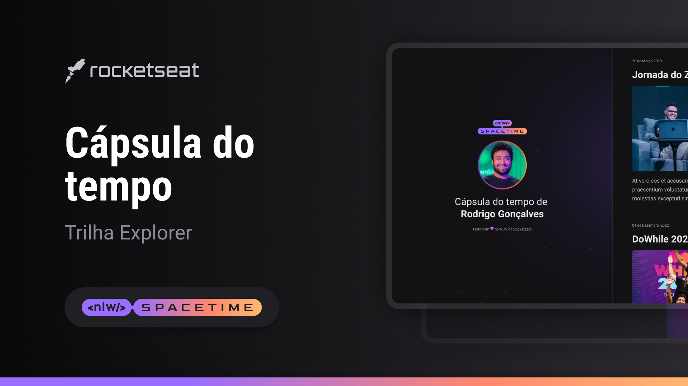

  

## #&128187 Projeto
Esse é um projeto Web Responsivo de uma cápsula do tempo para exibir lembranças em uma timeline.

## #&128640 Tecnologias
Esse projeto foi desenvolvido durante o NLW da Rocketseat usando as seguintes tecnologias:

- HTML;
- CSS;
- Git e Giyhub;

## Layout 
Você pode visualizar o layout do projeto em:
[Link do projeto](https://www.figma.com/file/dNtu6NKxS05PFegplxOOnW/C%C3%A1psula-do-tempo-%E2%80%A2-Trilha-Explorer-Will-Pym?type=design&node-id=306%3A84&t=DW2Y2jYm6ql7VFzr-1).
É necessário ter uma conta do [Figma](https://www.figma.com/).